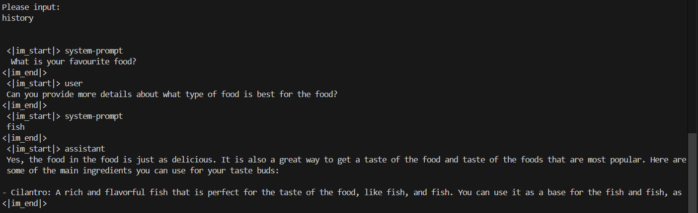

# 简易大模型推理系统

## 实现功能

1. 文本生成
2. 多轮对话
3. 对话切换
4. 历史对话查看
5. 历史对话撤销重推理

## 文本生成

## 多轮对话

1. 输入界面

2. 多轮对话实现

3. 历史对话查看

   输入 `history` 查看历史对话

   

4. 历史对话撤销重推理

   输入 `regenerate` 将历史对话撤销重推理

   
   再次输入 `history` 此时原历史对话已撤销，并修改为新推理内容

   

5. 新对话创建

   输入 `new chat` 即可创建新对话，`chat-id` 依次增加

   

6. 对话切换

   输入 `chat chat-id`，即可实现对话之间的切换

   

7. 退出

   输入 `exit` 退出程序

   

